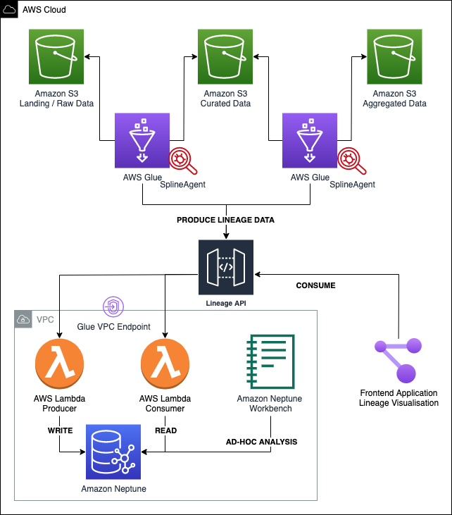

## Data Lineage for Data Lakes Example

This repository contains an example project for building Data Lineage for data lakes using AWS Glue, Amazon Neptune and Spline Agent.

Remarks: This setup works with AWS Glue Data Permissions Model and does not support Lake Formation Permission Model. 

### Stack
- API: HTTP API powered by an API Gateway and lambda functions
- Frontend: Vue.js application

### Build & Deployment
To deploy the solution to AWS Cloud with terraform, export your AWS Credentials to terraform (AWS Profile or environment variables)



Variables (in _terraform.tfvars_):
  - VPC ID: the VPC to host Amazon Neptune database and lambda functions. You can choose AWS default VPC
  - **Important!** Glue VPC endpoint is required in the selected VPC
  
```
terraform init

# download spline agent jar
wget https://repo1.maven.org/maven2/za/co/absa/spline/agent/spark/spark-2.4-spline-agent-bundle_2.11/0.5.6/spark-2.4-spline-agent-bundle_2.11-0.5.6.jar -O ./asset/lib/spark-2.4-spline-agent-bundle_2.11-0.5.6.jar

terraform apply
```

To build and test the lineage visual application locally:
- update the lineage backend address in `src/lineage-visual/src/main.js`
```javascript
axios.defaults.baseURL = "https://xxx.execute-api.eu-west-1.amazonaws.com/dev";
```

```shell
cd src/lineage-visual
npm install
npm run serve
```

## Getting started
- Run the first Glue Job
```shell
aws glue start-job-run --job-name "RawToCurated_employee_optimize"
```
- Open the **lineage visual** application
- Run the second Glue Job
```shell
aws glue start-job-run --job-name "CuratedToAggregated_employee"
```
- Refresh the **lineage visual** application

## Security

See [CONTRIBUTING](CONTRIBUTING.md#security-issue-notifications) for more information.

## License

This library is licensed under the MIT-0 License. See the LICENSE file.
